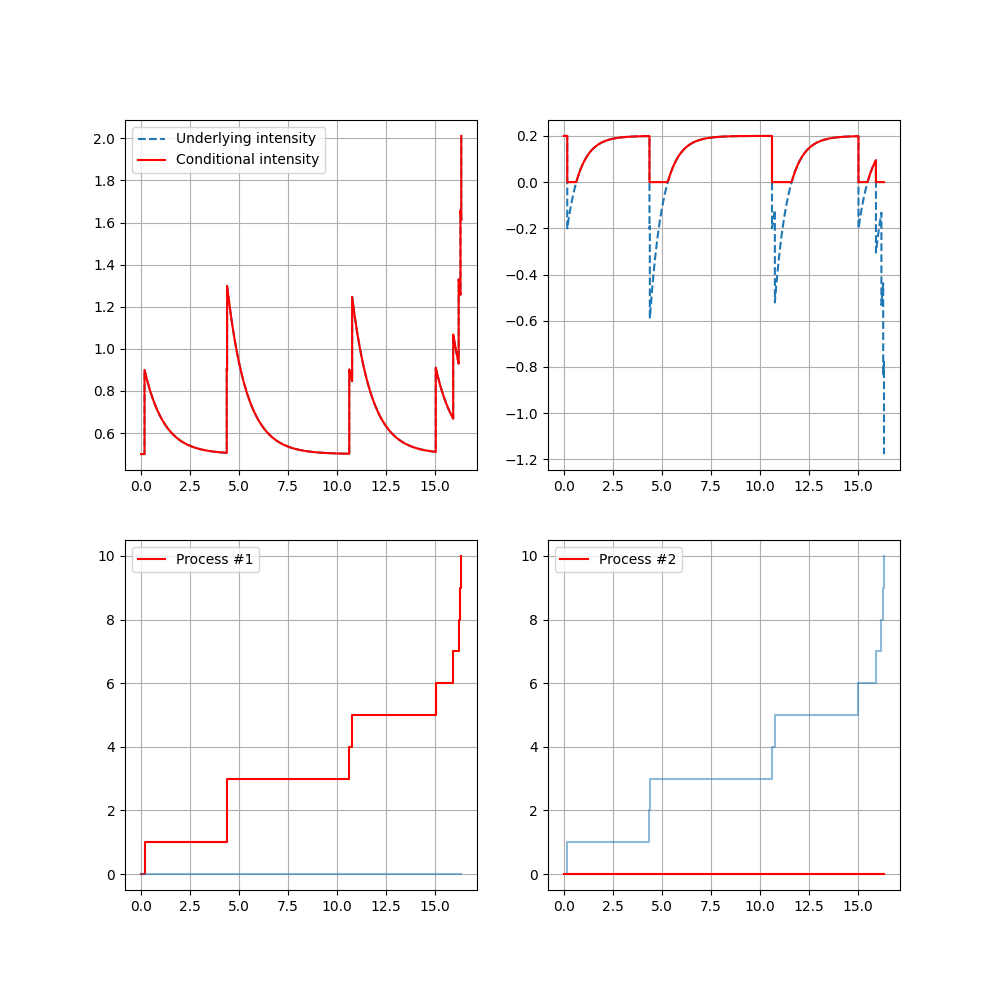

# Simulation, estimation  and test for a Multidimensional Marked Exponential Hawkes Process ( MMEHP )

## Introduction

This project provides a Python implementation for simulating and estimating a uni or multi-dimensional marked Hawkes process. In addition to simulation and estimation features, the code includes testing procedures to verify the model fitting to observed data.

## Features

### 1. Simulation of a Multidimensional Marked Hawkes Process
- **Process simulation:** Two main class allow for simulating of a marked Hawkes process, ``exp_thinning_hawkes_marked``and ``multivariate_exponential_hawkes_marked`` based on the thinning procedure. Users must specify model parameters, such as the baseline intensities, the interaction coefficients, the caracteritic times and mark distributions.

### 2. Model Parameter Estimation
- **Likelihood Calculation Functions:** Different functions such as ``multivariate_marked_likelihood``, ``loglikelihoodMarkedHawkes``,``multivariate_loglikelihood_simplified`` or ``loglikelihood``, allow to cumpute the likelihood of a parameter in different Hawkes model, given a set of data.
- **Parameter Estimation:** Two class allows to compute the parameter of either a multidimensional or unidimensional Hawkes process when one or more repetition of the process are available: ``estimator_unidim_multi_rep``, ``estimator_multidim_multi_rep``, ``loglikelihood_estimator`` and ``multivariate_estimator` . All of them require the user so specify the model characteristic, such as the type of parametrisation chosen for the impact function and the density of the mark, the associated name of paramter and the space they are embedded in.   

### 3. Testing Procedures
- **Testing a Specific Coefficient Value:** This procedure, associated to the estimator class with several repetition available, allows testing whether a given coefficient in the model equals a specific predefined value.
- **Testing Coefficient Equality:** This procedure, associated to the estimator class with several repetition available, allows testing whether two coefficients in the model are equals.
- **Goodness-of-Fit (GOF) Tests:** This procedure, associated to the estimator class with several repetition available, allows testing the model fit on the data by.


## Usage 

### Simulation

```py
from functions.multivariate_exponential_process import *
from functions.paramtrised_function import *
import scipy 
import numpy as np

np.rando.seed(0)

# Define model parameters

m, a, b = 1, -1, 2

# Simulate the process

hawkes_multi = multivariate_exponential_hawkes_marked(m=m,
                                                      a=a, 
                                                      b=b, 
                                                      phi = phi, 
                                                      F= F, 
                                                      arg_phi={'gamma':phi_a1rg}, 
                                                      arg_F={'psi': 2}, 
                                                      max_jumps  = 10)

hawkes_multi.simulate()
timestamps = hawkes_multi.timestamps
fig,ax = plt.subplots(2,2, figsize = (10,10))
hawkes_multi.plot_intensity(ax = ax)
```



### Estimation

```py 

np.random.seed(0)

m=1
a = -1
b = 1

## simulation 
hawkes_multi = exp_thinning_hawkes_multi_marked(m=m,
                                    a=a, 
                                    b=b, 
                                    n=200,
                                    max_jumps=500)
hawkes_multi.simulate()


estimator = learner_hawkes = estimator_unidim_multi_rep(a_bound = None, bound_b = None)
estimator.fit(hawkes_multi.timeList, max_jump = True)

```

### Test

```py 

## test on the value of the coefficient
stat = learner_hawkes.test_one_coeff( coefficient_index=0, value = 1,plot=True)

## GOF procedure with bootstrap
stat_hawkes = learner_hawkes.GOF_bootstrap(test_type = 'uniform', 
                            Nb_SubSample=100, 
                            plot = True)

```


## Examples 

Complete usage examples are available in the examples notebook, with scripts illustrating simulation, estimation, and testing.


## Dependencies

This code was implemented using Python 3.12.4 and needs Numpy, Matplotlib, Scipy, rpy2, IPython, functools, multiprocessing.
